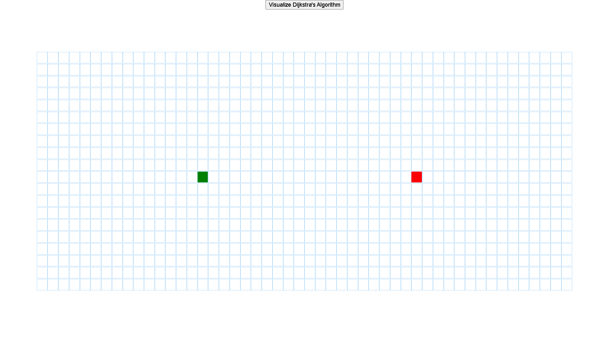
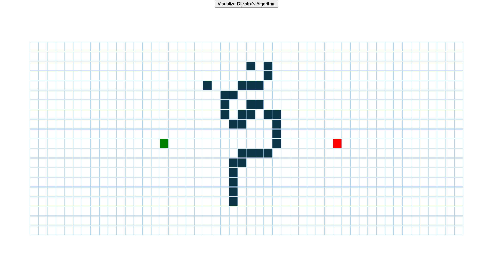
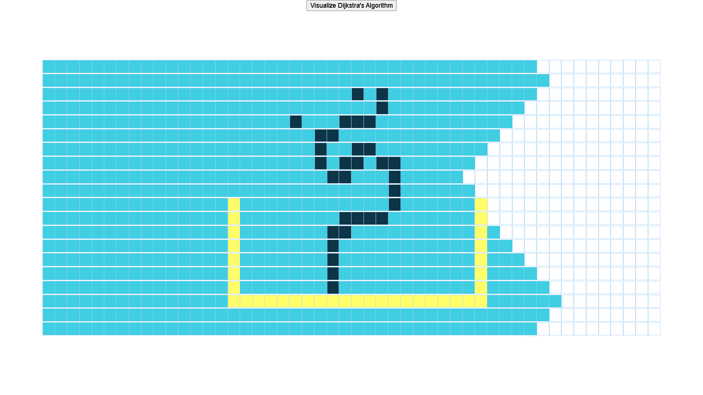

# Dijkstra-s-Algorithm-Visualizer
Dijkstra's algorithm (or Dijkstra's Shortest Path First algorithm, SPF algorithm)[4] is an algorithm for finding the shortest paths between nodes in a graph, which may represent, for example, road networks. This visualizer is an online visualizing tool to analyze the Dijkstras Algorithm and calculate the shortest path. This can help to understand the algorithm easier with the visualizations and steps. 

## The online visualizer can be visited here :

[Dijkstras Algorithm Visualizer](https://dijkstrasvisualizer.web.app)

 

 

 

